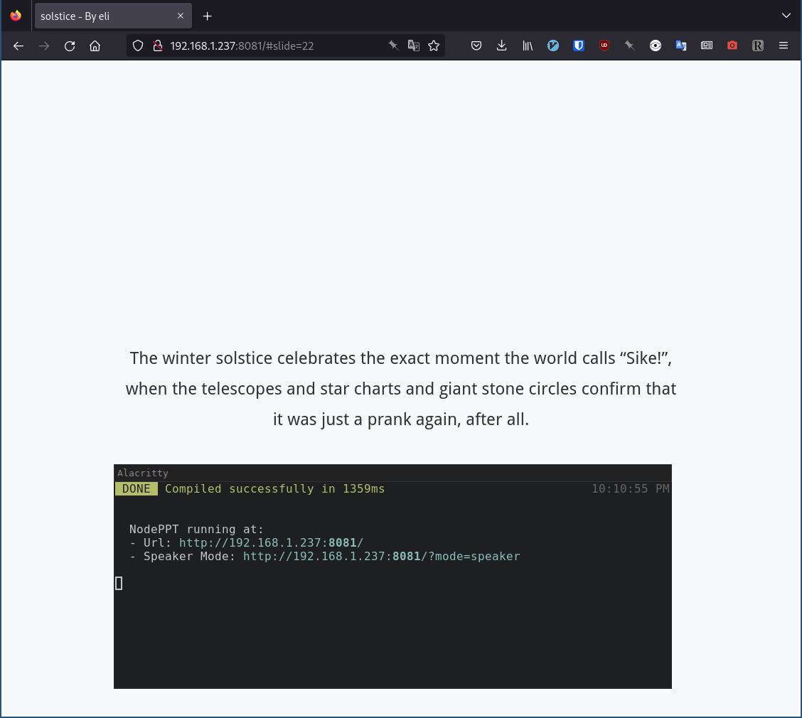
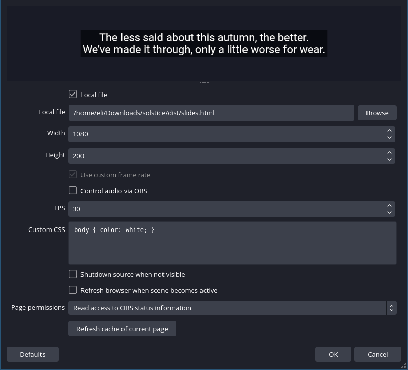
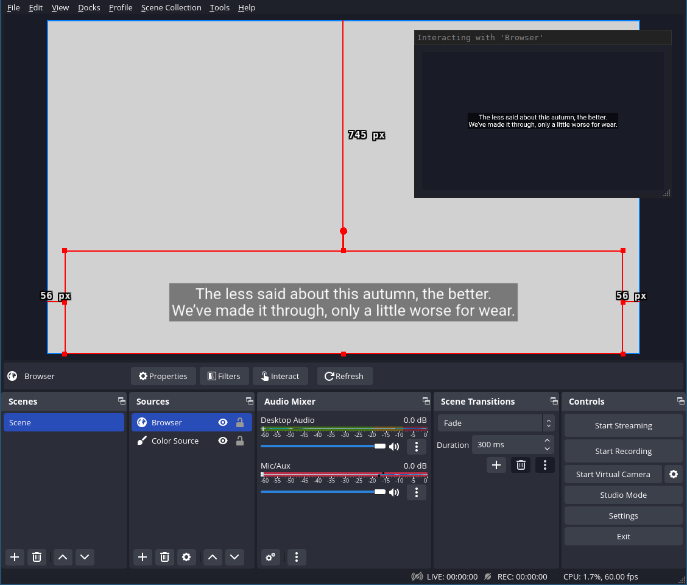
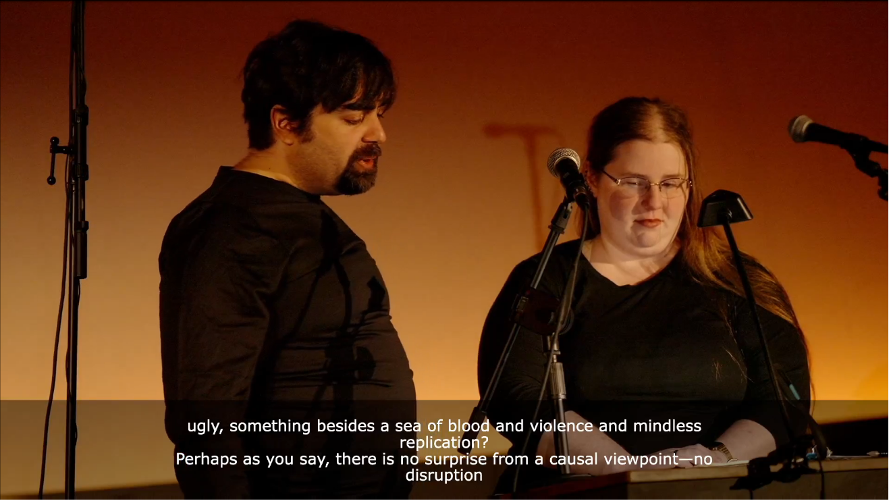

[WIP]


I recently ran the Twitch stream for the 2022 Bay Area Solstice event, which
included live music and speeches. We wanted the stream to have captions so that
people at home could follow along even if they couldn't hear everything
perfectly for whatever reason--be it the speaker not leaning into the mic, song
lyrics being hard to make out, hard of hearing, etc. Although we would've
preferred closed captions, I couldn't quite figure that out in time for the
event, so we went for open "hardcoded" captions for the live event with the
intention of uploading a closed caption version to Youtube afterwards.


Here's how I did it and where I think I could've done things better!


## Overview

1. Get the script in plaintext format
2. Preprocess, i.e. manually split it up into chunks to be displayed on the screen
3. Generate slides from the chunked script
4. Add source to OBS
5. During the show, advance the slideshow captions to keep up with speech and song


## Prerequisites

This workflow requires comfort with the command line and some bash/python scripting.

Knowledge of some basic HTML/CSS is also helpful if you need to tweak the caption appearance.

- **bash**: for some basic scripting 
- **python**: to automatically turn the plaintext captions into a markdown slide format
- **npm**: to install `nodeppt`, our markdown-slides generator
- **OBS**: for the stream :)

## Preprocessing

Make a copy of the script and save it as `script-captions.txt`.  Making a
separate copy of the processed text is helpful because it means you don't have
to redo the entire script should parts of it get updated.  Instead, you can
re-download updated versions of the script as `script-edited-2022-12-19.txt`
and use the `diff` tool with the previous copy of the script to just see the
differences.  Then you can update `script-captions.txt` with just the updated
text.

Captions need to be readable, which means keeping a short line length and
keeping only a small number of lines on the screen at a time.  Readable line
length is about 80 characters long.  For speech, there should be at most 2-3
lines on the screen at a time.

For songs, I made an exception to the rule that captions should be at most 2
lines long, because some songs go quickly.  I chose to allow song lyrics a
maximum of 4 lines on-screen at a time.  These lines should ideally be short or
repetitive like a chorus.


## Generating slides

When it comes to markdown-based slide apps, there are a
[lot of options](https://gist.github.com/johnloy/27dd124ad40e210e91c70dd1c24ac8c8).

I tried a few of them and landed on
[`nodeppt`](https://github.com/ksky521/nodeppt#%E9%85%8D%E7%BD%AE) because it:

- has simple syntax for delimiting slides
- supports custom css (and has nice css by default)
- works as a webserver with hot-reload for local development
- can also make a static build with all of the html, css, and js needed
- doesn't rely on some hosted service
- is free and open-source
- worked


Make sure you have npm installed
(if not, [follow their docs](https://docs.npmjs.com/downloading-and-installing-node-js-and-npm#using-a-node-version-manager-to-install-nodejs-and-npm)).

Then you can install `nodeppt`.

```bash
npm install -g nodeppt
```

Create a new file called `make-slides.py` and paste the following inside:

```python
#!/usr/bin/env python

import re

# preamble is required at the top of slide.md for nodeppt
# https://github.com/ksky521/nodeppt#%E9%85%8D%E7%BD%AE
preamble = """title: solstice
speaker: eli
css: [./css/style.css]
plugins:
    - echarts"""

# this line denotes a new slide
new_slide = '<slide :class="aligncenter slide-bottom">'

def make_slides(script: str):
    deck = [preamble]
    # assume the script has been preprocessed such that new slides are
    # delimited by two or more newlines in a row
    split = re.split("\n\n+", script)

    for l in split:
        # ensure each newline is interpreted correctly by markdown
        # without this, newlines will just turn into spaces in the slides
        l = l.replace("\n", "  \n")
        # create new slide
        deck.append(new_slide + "\n" + l + "\n\n")

    # put the whole thing together
    return "\n".join(deck)


def main(in_file, out_file):
    with open(in_file, "r") as f:
        script = f.read()
    deck = make_slides(script)
    with open(out_file, "w") as f:
        f.write(deck)


if __name__ == "__main__":
    import sys
    assert len(sys.argv) == 3, f"{__file__} in_file out_file"
    main(sys.argv[1], sys.argv[2])
```

Then to generate the markdown for slides, you can run:
```
python ./make-slides.py script-captions.txt slides.md
```

This will take your `script-captions.txt` file as input, then add the markdown
sauce for turning it into a proper slide deck called `slides.md` for use with
`nodeppt`. 


Now you can use `nodeppt serve slides.md` to start a local dev server to
display your slides. It will hot-reload when it detects changes to `slides.md`.




When you've finalized the captions, you can do `nodeppt build slides.md`. This
will dump everything to the `dist/` subdirectory, which you can easily wrap in
a tarball and transfer to the streaming computer.


## Configuring OBS

Make sure to install OBS via one of the **official** methods, otherwise it may be outdated.
I ran into this on Fedora linux and my version didn't have Browser Source support.

https://obsproject.com/wiki/install-instructions

Now we can proceed one of two ways: either add the captions as a _browser
source_ (preferred) or use screen capture on your browser's application window
combined with layer blending to make it transparent.

Browser source is the best and you should only fallback to screen capture if
you can't get browser source to work.


### Browser source

Add a new Browser Source to the scene. For the destination, check "Local file"
and click "Browse" to set the destination to the `dist/index.html` file
generated by `nodeppt build`.



When you have the Browser source selected, the OBS toolbar should have an
"Interact" button to open up an interactive window to the browser. From here you
can advance the slides by using the left and right arrow keys.



### Application window capture 


TODO


### Adjust style/appearance


TODO


## Improvements


To anyone attempting this in the future (maybe me...), here are some things I wish I'd done:

**Test things on the streaming computer before going all in**

I incorrectly assumed things would work on the streaming computer the same way
they did on _my_ computer.

This bit me in two ways: first, the browser source didn't work! Everything
looked fine up until the moment I tried advancing the slideshow, at which point
I saw it was bugged and advanced multiple slides at a time. I didn't have time
to debug or fix it, so I had to fall back to the window capture, which looked
slightly worse and was more error-prone. I could close the tab or resize the
window by accident, and it would show up on the stream!

The second way this bit me was because the display resolution and text
rendering were different, so a whole bunch of the manual line breaks I
painstakingly added for flow ended up looking terrible. I really wanted to do
these speeches justice, so the formatting errors made me feel pretty bad :(



Alas, I was far too busy keeping up with the show to either fix the CSS on this or redo the line breaks.

**Have a dedicated crew member for the captions**

Advancing the captions to keep up with the show basically took all of my focus,
because at most I could toggle away for 1-2 sentences at a time before I need to
tab over to the browser and go to the next slide.

This meant I couldn't update anything about the captions, like I mentioned
above; it also meant I couldn't help the camera crew by applying any effects
from OBS, or help with the audio mix to tweak it for a better home-listening
experience. There were at least a couple moments I can remember this would have
come in handy.


**Figure out real closed-captions**

_Closed_ captions refers to when the captions can be toggled on/off by viewers,
and this is the preferred way to distribute captions. Not only does this enable
viewers to choose whether or not they want to see captions at all, it also
allows users to style the captions to their own preference--they could use
bright yellow text with black outline, make the text bigger/smaller, add a fully
opaque background, etc. This requires us to use an industry-standard encoding
like EIA-708 or [EIA-608](https://en.wikipedia.org/wiki/EIA-608) that the
destination accepts and decodes as part of the video stream.

For the livestream, I instead did _open_ captions, sometimes known as
"hardcoded" subtitles/captions, because that's what I could figure out how to
do. Everyone gets the captions; they're burned into the video, and they all get
the same caption style that I chose.

Unfortunately I couldn't figure out how to do closed captions in time for the
main event.  There were plenty of tutorials for AI-assisted closed captioning
with OBS, but I couldn't easily find anything about closed captions in OBS for
scripted events, where AI captions were both unnecessary and less accurate.

It would be neat to get this set up for next time, but might require some
_actual_ programming since I'm not sure there's already an OBS plugin for doing
this.